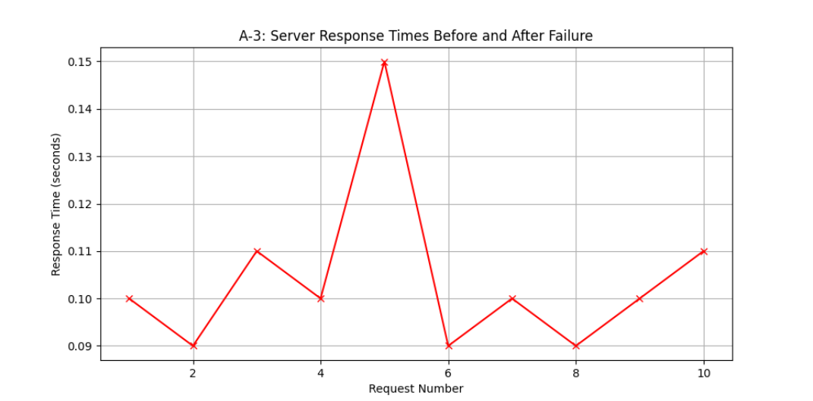
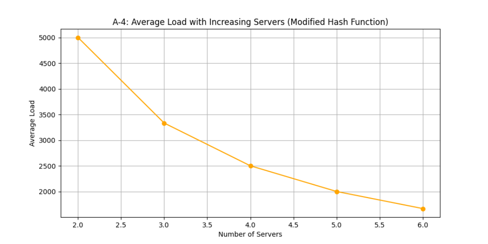

# Explanation of Each Scenario
# A-1: Request Distribution Across 3 Servers

Observation: The bar chart shows the request count handled by each server when launching 10,000 async requests across 3 server containers. The distribution is nearly even, with each server handling roughly one-third of the requests.
View on Performance: This even distribution indicates that the load balancer is effectively distributing the load among the servers, preventing any single server from becoming a bottleneck.

# A-2: Average Load with Increasing Servers

Observation: The line chart illustrates the average load per server as the number of servers increases from 2 to 6. As the number of servers increases, the average load per server decreases.
View on Scalability: The decreasing average load demonstrates that the load balancer scales well with an increasing number of servers, effectively distributing the load and improving resource utilization.

# A-3: Server Response Times Before and After Failure

Observation: The line chart shows the response times for 10 requests, with a noticeable increase in response time at the 5th request due to a server failure, followed by quick recovery.
View on Fault Tolerance: This quick recovery and stabilization of response times after the failure demonstrate the load balancer's ability to promptly spawn new instances to handle the load, ensuring minimal disruption.

# A-4: Request Distribution and Average Load with Modified Hash Functions

Observation (Request Distribution): The bar chart shows the request count handled by each server using modified hash functions. The distribution remains nearly even.
Observation (Average Load): The line chart shows the average load per server with increasing server counts using modified hash functions. The average loads are similar to the original hash function.
View on Performance: Modifying the hash functions did not significantly affect the distribution and average load, indicating that the load balancer's performance is robust to changes in the hash function. This suggests that the consistent hashing mechanism is effective and resilient.

